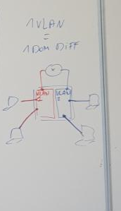
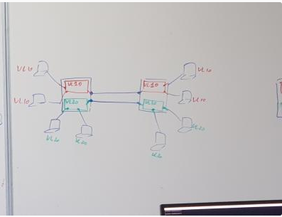
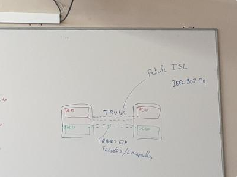
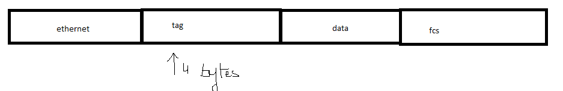

# 20210309 CLI SWITCH CISCO

***switch a utiliser #2960-7 (convention steve)***

    routeur >>> fa0/0 192.168.0.32 /24
    

##### ***Remise à zéro switch***

    Switch>enable
    Switch#erase nvram:
    Erasing the nvram filesystem will remove all configuration files! Continue? [confirm]
    [OK]
    Erase of nvram: complete
    Switch#
    *Mar  4 23:59:35.046: %SYS-7-NV_BLOCK_INIT: Initialized the geometry of nvram
    Switch#delete vlan.dat
    Delete filename [vlan.dat]?                                      >>>>> action en plus que routeur
    Delete flash:/vlan.dat? [confirm]
    %Error deleting flash:/vlan.dat (No such file or directory)     >>>>> pas de vlan present sur cette config
    Switch#reload
    Proceed with reload? [confirm]

##### ***configuration de base(configuration terminal)***
   
    (config)# hostname <....>
    (config)# enable secret <....> [user exec a priviligié]
    (config)# service password-encryption
    (config)# line console 0
    (config-line)# exec-timeout <0> <0> ( desactiver timeout session)
    (config-line)# logging synchronous (desactive la separation de la ligne de commande)
    (config-line)# password <....> (mdps = admin)
    (config-line)# login

##### ***Show interface status***

    2960-7#show interface status

    Port      Name               Status       Vlan       Duplex  Speed Type
    Fa0/1                        notconnect   1            auto   auto 10/100BaseTX
    Fa0/2                        notconnect   1            auto   auto 10/100BaseTX
    Fa0/3                        notconnect   1            auto   auto 10/100BaseTX
    Fa0/4                        notconnect   1            auto   auto 10/100BaseTX
    Fa0/5                        notconnect   1            auto   auto 10/100BaseTX
    Fa0/6                        notconnect   1            auto   auto 10/100BaseTX
    Fa0/7                        notconnect   1            auto   auto 10/100BaseTX
    Fa0/8                        notconnect   1            auto   auto 10/100BaseTX
    Fa0/9                        notconnect   1            auto   auto 10/100BaseTX
    Fa0/10                       notconnect   1            auto   auto 10/100BaseTX
    Fa0/11                       notconnect   1            auto   auto 10/100BaseTX
    Fa0/12                       notconnect   1            auto   auto 10/100BaseTX
    Fa0/13                       notconnect   1            auto   auto 10/100BaseTX
    Fa0/14                       notconnect   1            auto   auto 10/100BaseTX
    Fa0/15                       notconnect   1            auto   auto 10/100BaseTX
    Fa0/16                       notconnect   1            auto   auto 10/100BaseTX
    Fa0/17                       notconnect   1            auto   auto 10/100BaseTX
    Fa0/18                       notconnect   1            auto   auto 10/100BaseTX
    Fa0/19                       notconnect   1            auto   auto 10/100BaseTX
    Fa0/20                       notconnect   1            auto   auto 10/100BaseTX
    Fa0/21                       notconnect   1            auto   auto 10/100BaseTX
    Fa0/22                       connected    1          a-full  a-100 10/100BaseTX

    Port      Name               Status       Vlan       Duplex  Speed Type
    Fa0/23                       notconnect   1            auto   auto 10/100BaseTX
    Fa0/24                       notconnect   1            auto   auto 10/100BaseTX
    Gi0/1                        connected    1          a-full a-1000 10/100/1000BaseTX
    Gi0/2                        connected    1          a-full a-1000 10/100/1000BaseTX

    name      : description données aux interfaces (important de faire)
    status    : possible connected , non connected , disable (shutdown)
    interface : switch no shut par defaut
    vlan      : information des vlans avec domaines de diffusion 
    duplex    : half/full
    
    -------------- commande de troubleshooting ----------------

##### ***show interface description***

    2960-7#show interface description
    Interface                      Status         Protocol Description
    Vl1                            up             up
    Fa0/1                          down           down
    Fa0/2                          down           down
    Fa0/3                          down           down
    Fa0/4                          down           down
    Fa0/5                          down           down
    Fa0/6                          down           down
    Fa0/7                          down           down
    Fa0/8                          down           down
    Fa0/9                          down           down
    Fa0/10                         down           down
    Fa0/11                         down           down
    Fa0/12                         down           down
    Fa0/13                         down           down
    Fa0/14                         down           down
    Fa0/15                         down           down
    Fa0/16                         down           down
    Fa0/17                         down           down
    Fa0/18                         down           down
    Fa0/19                         down           down
    Fa0/20                         down           down
    Fa0/21                         down           down
    Fa0/22                         up             up
    Fa0/23                         down           down
    Fa0/24                         down           down
    Gi0/1                          up             up
    Gi0/2                          up             up

##### ***2960-7#show int fa0/1*** (meme que sur routeur)

    2960-7#show int fa0/1
    FastEthernet0/1 is down, line protocol is down (notconnect)
      Hardware is Fast Ethernet, address is e840.4017.5f01 (bia e840.4017.5f01)
      MTU 1500 bytes, BW 10000 Kbit/sec, DLY 1000 usec,
        reliability 255/255, txload 1/255, rxload 1/255
      Encapsulation ARPA, loopback not set
      Keepalive set (10 sec)
      Auto-duplex, Auto-speed, media type is 10/100BaseTX
      input flow-control is off, output flow-control is unsupported
      ARP type: ARPA, ARP Timeout 04:00:00
      Last input never, output never, output hang never
      Last clearing of "show interface" counters never
      Input queue: 0/75/0/0 (size/max/drops/flushes); Total output drops: 0
      Queueing strategy: fifo
      Output queue: 0/40 (size/max)
      5 minute input rate 0 bits/sec, 0 packets/sec
      5 minute output rate 0 bits/sec, 0 packets/sec
        0 packets input, 0 bytes, 0 no buffer
        Received 0 broadcasts (0 multicasts)
        0 runts, 0 giants, 0 throttles
        0 input errors, 0 CRC, 0 frame, 0 overrun, 0 ignored
        0 watchdog, 0 multicast, 0 pause input
        0 input packets with dribble condition detected
        0 packets output, 0 bytes, 0 underruns

#####  ***show mac address-table***

    2960-7#show mac address-table
          Mac Address Table
    -------------------------------------------

    Vlan    Mac Address       Type        Ports
    ----    -----------       --------    -----
    All    0100.0ccc.cccc    STATIC      CPU
    All    0100.0ccc.cccd    STATIC      CPU
    All    0180.c200.0000    STATIC      CPU
    All    0180.c200.0001    STATIC      CPU
    All    0180.c200.0002    STATIC      CPU
    All    0180.c200.0003    STATIC      CPU
    All    0180.c200.0004    STATIC      CPU
    All    0180.c200.0005    STATIC      CPU
    All    0180.c200.0006    STATIC      CPU
    All    0180.c200.0007    STATIC      CPU
    All    0180.c200.0008    STATIC      CPU
    All    0180.c200.0009    STATIC      CPU
    All    0180.c200.000a    STATIC      CPU
    All    0180.c200.000b    STATIC      CPU
    All    0180.c200.000c    STATIC      CPU
    All    0180.c200.000d    STATIC      CPU
    All    0180.c200.000e    STATIC      CPU
    All    0180.c200.000f    STATIC      CPU
    All    0180.c200.0010    STATIC      CPU
    All    ffff.ffff.ffff    STATIC      CPU
      1    001d.712a.c199    DYNAMIC     Gi0/2
      1    001d.a104.eca0    DYNAMIC     Gi0/2
      1    001e.130c.1c52    DYNAMIC     Gi0/1
      1    001e.7a4c.a88e    DYNAMIC     Fa0/22
      1    e840.4014.5e9a    DYNAMIC     Gi0/1

    type = static/dynamic
    ffff.ffff.ffff entree static broadcast (hardcodé)

***********************************************************************************************************

##### ***METHODE DE RECHERCHE RAPIDE ET FOCALISER*** 

***show interface fa0/0 | include <>***     (chercher mac adress du routeur sur le ROUTEUR )

    P3R2#sh int fa0/0 |  include bia                                      bia = buildt in adress
      Hardware is Gt96k FE, address is 001e.7a4c.a88e (bia 001e.7a4c.a88e)

***show mac address-table | include <mac adress>***   (Sur SWITCH pr affiché que cette macadd la)

      2960-7#show mac address-table | include 001e.7a4c.a88e   
        1    001e.7a4c.a88e    DYNAMIC     Fa0/22

***********************************************************************************************************

##### ***CDP ( CISCO DISCOVERY PROTOCOL )*** concurrent libre LLDP 
    
    > protocol de niveau l2 ( sur la liaison pas commuté)
    > Propriétaire a cisco
    > activé par defaut
    > commande
    >> show cdp neighbour 
        2960-7#show cdp neigh
          Capability Codes: R - Router, T - Trans Bridge, B - Source Route Bridge
                      S - Switch, H - Host, I - IGMP, r - Repeater, P - Phone,
                      D - Remote, C - CVTA, M - Two-port Mac Relay

              Device ID        Local Intrfce     Holdtme    Capability  Platform  Port ID
              P3R2             Fas 0/22          137             R S I  2801      Fas 0/0
              2960-8           Gig 0/2           144              S I   WS-C2960- Gig 0/1
              2960-6bonjour    Gig 0/1           131              S I   WS-C2960- Gig 0/2
      
              device id : hostname
              local interface : mon interface 
              holdtime : durée de vie de l'information defaut=180secondes interval emission=60 Secondes
                        ne devrais pas etre en dessous de 120 car 180-60 = 120 (de 180 à 120)
              capability : S = switch I = igmp ( protocol control traffic pour optimisé multicast) R = routeur
                          igmp snooping
              platform : type de platform = modele
              Port id : interface du voisin 

##### ***2960-7#show cdp neigh detail***

            2960-7#show cdp neigh detail
            -------------------------
            Device ID: P3R2
            Entry address(es):
              IP address: 192.168.0.32
            Platform: Cisco 2801,  Capabilities: Router Switch IGMP
            Interface: FastEthernet0/22,  Port ID (outgoing port): FastEthernet0/0
            Holdtime : 130 sec

            Version :
            Cisco IOS Software, 2801 Software (C2801-ADVIPSERVICESK9-M), Version 12.4(22)T, RELEASE SOFTWARE (fc1)
            Technical Support: http://www.cisco.com/techsupport
            Copyright (c) 1986-2008 by Cisco Systems, Inc.
            Compiled Fri 10-Oct-08 01:34 by prod_rel_team

            advertisement version: 2
            Duplex: full
            Management address(es):

            -------------------------
            Device ID: 2960-8
            Entry address(es):
            Platform: cisco WS-C2960-24TT-L,  Capabilities: Switch IGMP
            Interface: GigabitEthernet0/2,  Port ID (outgoing port): GigabitEthernet0/1
            Holdtime : 136 sec

            Version :
            Cisco IOS Software, C2960 Software (C2960-LANBASEK9-M), Version 12.2(58)SE2, RELEASE SOFTWARE (fc1)
            Technical Support: http://www.cisco.com/techsupport
            Copyright (c) 1986-2011 by Cisco Systems, Inc.
            Compiled Thu 21-Jul-11 02:13 by prod_rel_team

            advertisement version: 2
            Protocol Hello:  OUI=0x00000C, Protocol ID=0x0112; payload len=27, value=00000000FFFFFFFF010221FF000000000000001D712AC180FF0000
            VTP Management Domain: ''
            Native VLAN: 1
            Duplex: full
            Management address(es):
            -------------------------
            Device ID: 2960-6bonjour
            Entry address(es):
            Platform: cisco WS-C2960-24TT-L,  Capabilities: Switch IGMP
            Interface: GigabitEthernet0/1,  Port ID (outgoing port): GigabitEthernet0/2
            Holdtime : 123 sec

            Version :
            Cisco IOS Software, C2960 Software (C2960-LANBASEK9-M), Version 12.2(58)SE2, RELEASE SOFTWARE (fc1)
            Technical Support: http://www.cisco.com/techsupport
            Copyright (c) 1986-2011 by Cisco Systems, Inc.
            Compiled Thu 21-Jul-11 02:13 by prod_rel_team

            advertisement version: 2
            Protocol Hello:  OUI=0x00000C, Protocol ID=0x0112; payload len=27, value=00000000FFFFFFFF010221FF000000000000E84040145E80FF0000
            VTP Management Domain: ''
            Native VLAN: 1
            Duplex: full
            Management address(es):

##### ***show cdp entry <HOSTNAME>*** (meme qu'avant mais simplifié sur un hostname)
        
        2960-7#show cdp entry P3R2
        -------------------------
        Device ID: P3R2
        Entry address(es):
          IP address: 192.168.0.32
        Platform: Cisco 2801,  Capabilities: Router Switch IGMP
        Interface: FastEthernet0/22,  Port ID (outgoing port): FastEthernet0/0
        Holdtime : 166 sec

        Version :
        Cisco IOS Software, 2801 Software (C2801-ADVIPSERVICESK9-M), Version 12.4(22)T, RELEASE SOFTWARE (fc1)
        Technical Support: http://www.cisco.com/techsupport
        Copyright (c) 1986-2008 by Cisco Systems, Inc.
        Compiled Fri 10-Oct-08 01:34 by prod_rel_team

        advertisement version: 2
        Duplex: full
        Management address(es):

##### ***2960-7#show cdp*** parametre de cdp

     2960-7#show cdp
      Global CDP information:
              Sending CDP packets every 60 seconds
              Sending a holdtime value of 180 seconds
              Sending CDPv2 advertisements is enabled

##### ***show cdp interface <FA0/xx>*** information sur l'interface

          2960-7#show cdp interface fa0/13
      FastEthernet0/13 is down, line protocol is down
        Encapsulation ARPA
        Sending CDP packets every 60 seconds
        Holdtime is 180 seconds

##### ***show cdp traffic***

        2960-7#show cdp traffic
        CDP counters :
                Total packets output: 173, Input: 169
                Hdr syntax: 0, Chksum error: 0, Encaps failed: 0
                No memory: 0, Invalid packet: 0,
                CDP version 1 advertisements output: 0, Input: 0
                CDP version 2 advertisements output: 173, Input: 169

##### ***desactiver cdp global*** ( plus sécuritaire pour la transmission d'info , par interface ou globalement)

          2960-7#conf t
          Enter configuration commands, one per line.  End with CNTL/Z.
          2960-7(config)#no cdp run

          2960-7#sh cdp
          % CDP is not enabled

##### ***activer cdp global***

          2960-7#conf t
          Enter configuration commands, one per line.  End with CNTL/Z.
          2960-7(config)#cdp run

##### ***activer cdp interface***

    2960-7#conf t
    Enter configuration commands, one per line.  End with CNTL/Z.
    2960-7(config)#int fa0/13
    2960-7(config-if)#cdp enable

##### ***desactiver cdp interface***

    2960-7#conf t
    Enter configuration commands, one per line.  End with CNTL/Z.
    2960-7(config)#int fa0/13
    2960-7(config-if)#no cdp enable

##### ***reglage cdp holdtime et interval***

    2960-7#conf t
    Enter configuration commands, one per line.  End with CNTL/Z.
    2960-7(config)#cdp holdtime 90                                 >>>>>(holdtime)
    2960-7(config)#cdp timer 30                                    >>>>>(interval)

    ------------------ bonne pratique 1 pour 3 ou 4 , entre holdtime et interval -----------------------

***********************************************************************************************************

##### ***2960-7#show int fa0/22***

    2960-7#show int fa0/22
    FastEthernet0/22 is up, line protocol is up (connected)

    P3R2#conf t
    Enter configuration commands, one per line.  End with CNTL/Z.
    P3R2(config)#int fa0/0
    P3R2(config-if)#shutdown

    2960-7#show int fa0/22
    FastEthernet0/22 is down, line protocol is down (notconnect)

    3 configurations possible
    Down/Down shutdown administrativly 
    Down/Down not connected int off ou pas de cable
    Up/Up 

***********************************************************************************************************

##### ***Configuration en package (config de tt les interfaces en meme temps)***

    2960-7(config)#interface range fa0/1, fa0/15 (seulement sur les interface listé, toujours mettre espace)

    2960-7(config)#interface range fa0/1 - 15    (toutes les interfaces entre 1 et 15, toujours mettre espace)

    2960-7(config)#interface range fa0/1 - 15 , fa0/20 - 24, g0/1 (plusieur ranges)(temps qu'on reste dans le mode chaque regles est appliqué a l'ensemble si sortie refaire)

    2960-7(config-if-range)#                    (resultat de ces commandes)

##### ***2960-7(config-if-range)#desc test range***

      Port      Name               Status       Vlan       Duplex  Speed Type
      Fa0/1     test range         notconnect   1            auto   auto 10/100BaseTX
      Fa0/2     test range         notconnect   1            auto   auto 10/100BaseTX
      Fa0/3     test range         notconnect   1            auto   auto 10/100BaseTX
      Fa0/4     test range         notconnect   1            auto   auto 10/100BaseTX
      Fa0/5     test range         notconnect   1            auto   auto 10/100BaseTX
      Fa0/6     test range         notconnect   1            auto   auto 10/100BaseTX
      Fa0/7     test range         notconnect   1            auto   auto 10/100BaseTX
      Fa0/8     test range         notconnect   1            auto   auto 10/100BaseTX
      Fa0/9     test range         notconnect   1            auto   auto 10/100BaseTX
      Fa0/10    test range         notconnect   1            auto   auto 10/100BaseTX
      Fa0/11    test range         notconnect   1            auto   auto 10/100BaseTX
      Fa0/12    test range         notconnect   1            auto   auto 10/100BaseTX
      Fa0/13    test range         notconnect   1            auto   auto 10/100BaseTX
      Fa0/14    test range         notconnect   1            auto   auto 10/100BaseTX
      Fa0/15    test range         notconnect   1            auto   auto 10/100BaseTX
      Fa0/16                       notconnect   1            auto   auto 10/100BaseTX
      Fa0/17                       notconnect   1            auto   auto 10/100BaseTX
      Fa0/18                       notconnect   1            auto   auto 10/100BaseTX
      Fa0/19                       notconnect   1            auto   auto 10/100BaseTX
      Fa0/20    test range         notconnect   1            auto   auto 10/100BaseTX
      Fa0/21    test range         notconnect   1            auto   auto 10/100BaseTX
      Fa0/22    test range         connected    1          a-full  a-100 10/100BaseTX

      Port      Name               Status       Vlan       Duplex  Speed Type
      Fa0/23    test range         notconnect   1            auto   auto 10/100BaseTX
      Fa0/24    test range         notconnect   1            auto   auto 10/100BaseTX
      Gi0/1     test range         connected    1          a-full a-1000 10/100/1000BaseTX
      Gi0/2                        connected    1          a-full a-1000 10/100/1000BaseTX

##### ***2960-7#show running-config*** ( proof que ce n'est pas un objet reel, juste une duplication de commande)

      interface FastEthernet0/1
      description test range
      !
      interface FastEthernet0/2
      description test range
      !
      interface FastEthernet0/3
      description test range
      !
      interface FastEthernet0/4

***********************************************************************************************************

##### ***VLAN*** 

    vlan = subdiviser le switch en plusieur domaine de diffusion
    trunk permet de gardé la continuité du domaine de diffusion a travers plusieurs equipements ( switch )

isl = protocl proprietaire cisco
ieee 802.1q ( dot1q) = protocol standard

ISL = encapsulation taille de trame plus gros
Dot1q = taggé information dans la trame 

dans le tag on trouve vlanid et qos (codé sur 3 bytes) 
exemple telephone cisco sur lequel un pc est cablé, qos pr definir les trames voip prioritaire par rapport au pc ( les telephons cisco voip on a un micro switch pr le faire)

##### Configuration VLAN

      Vlan valeur defaut = Vlan 1

      2960-7#sh int status

      Port      Name               Status       Vlan       Duplex  Speed Type
      Fa0/1     test range         notconnect   1            auto   auto 10/100BaseTX
      Fa0/2     test range         notconnect   1            auto   auto 10/100BaseTX
      Fa0/3     test range         notconnect   1            auto   auto 10/100BaseTX
      Fa0/4     test range         notconnect   1            auto   auto 10/100BaseTX
      Fa0/5     test range         notconnect   1            auto   auto 10/100BaseTX
      Fa0/6     test range         notconnect   1            auto   auto 10/100BaseTX
      Fa0/7     test range         notconnect   1            auto   auto 10/100BaseTX
      Fa0/8     test range         notconnect   1            auto   auto 10/100BaseTX
      Fa0/9     test range         notconnect   1            auto   auto 10/100BaseTX
      Fa0/10    test range         notconnect   1            auto   auto 10/100BaseTX
      Fa0/11    test range         notconnect   1            auto   auto 10/100BaseTX
      Fa0/12    test range         notconnect   1            auto   auto 10/100BaseTX
      Fa0/13    test range         notconnect   1            auto   auto 10/100BaseTX
      Fa0/14    test range         notconnect   1            auto   auto 10/100BaseTX
      Fa0/15    test range         notconnect   1            auto   auto 10/100BaseTX
      Fa0/16                       notconnect   1            auto   auto 10/100BaseTX
      Fa0/17                       notconnect   1            auto   auto 10/100BaseTX
      Fa0/18                       notconnect   1            auto   auto 10/100BaseTX
      Fa0/19                       notconnect   1            auto   auto 10/100BaseTX
      Fa0/20    test range         notconnect   1            auto   auto 10/100BaseTX
      Fa0/21    test range         notconnect   1            auto   auto 10/100BaseTX
      Fa0/22    test range         connected    1          a-full  a-100 10/100BaseTX

      Port      Name               Status       Vlan       Duplex  Speed Type
      Fa0/23    test range         notconnect   1            auto   auto 10/100BaseTX
      Fa0/24    test range         notconnect   1            auto   auto 10/100BaseTX
      Gi0/1     test range         connected    1          a-full a-1000 10/100/1000BaseTX
      Gi0/2                        connected    1          a-full a-1000 10/100/1000BaseTX

##### ***show vlan*** commande de base pour verifier si il y a vlan

        2960-7#show vlan  ( tjrs 4 vlan present qu'on ne peut pas supprimer 1002 1003 1004 1005)
        vlan entre 1 et 4095 ( zero pas utilisé)
        avant 1002 vl standar( utilisation normale)
        apres 1005 vl etendu ( quelque restriction)

        VLAN Name                             Status    Ports
        ---- -------------------------------- --------- -------------------------------
        1    default                          active    Fa0/1, Fa0/2, Fa0/3, Fa0/4
                                                        Fa0/5, Fa0/6, Fa0/7, Fa0/8
                                                        Fa0/9, Fa0/10, Fa0/11, Fa0/12
                                                        Fa0/13, Fa0/14, Fa0/15, Fa0/16
                                                        Fa0/17, Fa0/18, Fa0/19, Fa0/20
                                                        Fa0/21, Fa0/22, Fa0/23, Fa0/24
                                                        Gi0/1, Gi0/2
        1002 fddi-default                     act/unsup
        1003 token-ring-default               act/unsup
        1004 fddinet-default                  act/unsup
        1005 trnet-default                    act/unsup

        VLAN Type  SAID       MTU   Parent RingNo BridgeNo Stp  BrdgMode Trans1 Trans2
        ---- ----- ---------- ----- ------ ------ -------- ---- -------- ------ ------
        1    enet  100001     1500  -      -      -        -    -        0      0
        1002 fddi  101002     1500  -      -      -        -    -        0      0
        1003 tr    101003     1500  -      -      -        -    -        0      0
        1004 fdnet 101004     1500  -      -      -        ieee -        0      0
        1005 trnet 101005     1500  -      -      -        ibm  -        0      0

        Remote SPAN VLANs                >>>>vlan particulier , transite copy traffic dans une machine qui vas l'analyser : monitoring reseau
        ------------------------------------------------------------------------------

        Primary Secondary Type              Ports
        ------- --------- ----------------- ------------------------------------------

##### ***Show vlan brief***

      2960-7#show vlan brief
      VLAN Name                             Status    Ports
      ---- -------------------------------- --------- -------------------------------
      1    default                          active    Fa0/1, Fa0/2, Fa0/3, Fa0/4
                                                      Fa0/5, Fa0/6, Fa0/7, Fa0/8
                                                      Fa0/9, Fa0/10, Fa0/11, Fa0/12
                                                      Fa0/13, Fa0/14, Fa0/15, Fa0/16
                                                      Fa0/17, Fa0/18, Fa0/19, Fa0/20
                                                      Fa0/21, Fa0/22, Fa0/23, Fa0/24
                                                      Gi0/1, Gi0/2
      1002 fddi-default                     act/unsup
      1003 token-ring-default               act/unsup
      1004 fddinet-default                  act/unsup
      1005 trnet-default                    act/unsup

>>>>>> une interface a deux raison pour ne pas apparaitre la dedans , soit c'est un trunk, soit c un vlan dans une interface qui n'existe pas  

      status = active ou shutdown
      pas possible de supprimé le vlan1 et est toujours présent
      cdp par exemple est véhiculé dans vlan1
      dans la pratique on sort tout les interfaces du vlan1 car necessaire pr les protocol

##### ***Creation, suppression, modification de VLAN***

          2960-7#conf t
          2960-7(config)#vlan 10
          2960-7(config-vlan)# ?

                    VLAN configuration commands:
                    are          Maximum number of All Route Explorer hops for this VLAN (or zero
                                if none specified)
                    backupcrf    Backup CRF mode of the VLAN
                    bridge       Bridging characteristics of the VLAN
                    exit         Apply changes, bump revision number, and exit mode
                    media        Media type of the VLAN
                    mtu          VLAN Maximum Transmission Unit
                    name         Ascii name of the VLAN
                    no           Negate a command or set its defaults
                    parent       ID number of the Parent VLAN of FDDI or Token Ring type VLANs
                    remote-span  Configure as Remote SPAN VLAN
                    ring         Ring number of FDDI or Token Ring type VLANs
                    said         IEEE 802.10 SAID
                    shutdown     Shutdown VLAN switching
                    state        Operational state of the VLAN
                    ste          Maximum number of Spanning Tree Explorer hops for this VLAN (or
                                zero if none specified)
                    stp          Spanning tree characteristics of the VLAN
                    tb-vlan1     ID number of the first translational VLAN for this VLAN (or zero
                                if none)
                    tb-vlan2     ID number of the second translational VLAN for this VLAN (or
                                zero if none)

          2960-7(config-vlan)#name TRUCMUCHE
          2960-7#show vlan brief

          VLAN Name                             Status    Ports
          ---- -------------------------------- --------- -------------------------------
          1    default                          active    Fa0/1, Fa0/2, Fa0/3, Fa0/4
                                                          Fa0/5, Fa0/6, Fa0/7, Fa0/8
                                                          Fa0/9, Fa0/10, Fa0/11, Fa0/12
                                                          Fa0/13, Fa0/14, Fa0/15, Fa0/16
                                                          Fa0/17, Fa0/18, Fa0/19, Fa0/20
                                                          Fa0/21, Fa0/22, Fa0/23, Fa0/24
                                                          Gi0/1, Gi0/2
          10   TRUCMUCHE                        active

***Modification du vlan***

***2960-7(config)#int fa0/22***
          port acces >< port trunk        acces dans le vlan//acces hors du vlan
          2960-7(config-if)#switchport mode acces
                                            trunk
                                            dynamic auto (veux bien negocier quand on lui demande)
                                            dynamic desirable (entreprends la négociation)

          PROTOCOL DTP dynamic trunk protocol ( protocol sans sécurité et pas tres fiable )
          bonne pratique tjrs mettre en acces, sauf quand on veux un trunk

##### ***confiuration du switchport en mode acces*** (bonnes pratiques)

***2960-7(config-if)#switchport mode access*** 
***2960-7(config-if)#switchport acces vlan <vlanid>***
***2960-7#show interface fa0/22 switchport*** verifier switchport ( acces/trunk/dynauto/dyndesire)

        Name: Fa0/22
        Switchport: Enabled
        Administrative Mode: static access                                      >>mod interface configurer
        Operational Mode: static access                                         >>mod dans lequel le switch fonctionne reelement
        Administrative Trunking Encapsulation: dot1q                            >> dot1q
        Operational Trunking Encapsulation: native                              >> statis access dont pas d'encapsulation
        Negotiation of Trunking: Off                                            
        Access Mode VLAN: 10 (TRUCMUCHE)
        Trunking Native Mode VLAN: 1 (default)                                  >> 1vlan pour le traffic
        Administrative Native VLAN tagging: enabled
        Voice VLAN: none
        Administrative private-vlan host-association: none
        Administrative private-vlan mapping: none
        Administrative private-vlan trunk native VLAN: none
        Administrative private-vlan trunk Native VLAN tagging: enabled
        Administrative private-vlan trunk encapsulation: dot1q
        Administrative private-vlan trunk normal VLANs: none
        Administrative private-vlan trunk associations: none
        Administrative private-vlan trunk mappings: none
        Operational private-vlan: none
        Trunking VLANs Enabled: ALL                                             >> quel sont les vlan autorisé sur le trunk
        Pruning VLANs Enabled: 2-1001
        Capture Mode Disabled
        Capture VLANs Allowed: ALL

        Protected: false
        Unknown unicast blocked: disabled
        Unknown multicast blocked: disabled
        Appliance trust: none

##### ***creation du trunk***

      2960-7#conf t
      Enter configuration commands, one per line.  End with CNTL/Z.
      2960-7(config)#int g0/1
      2960-7(config-if)#switchport trunk encapsulation dot1q            >>>> a faire que sur les switch layer3
      2960-7(config-if)#switchport mode trunk

      2960-7#sh interface g0/1 switchport                               >>>> verification du trunk !!!!!
      Name: Gi0/1
      Switchport: Enabled
      Administrative Mode: trunk
      Operational Mode: trunk

##### ***2960-7#sh int trunk***  (commande de base pour le trunk)

      2960-7#sh int trunk

      Port        Mode             Encapsulation  Status        Native vlan   (si trame non taggué trunk passe par la)
      Gi0/1       on               802.1q         trunking      1
      Gi0/2       on               802.1q         trunking      1

      Port        Vlans allowed on trunk
      Gi0/1       1-4094
      Gi0/2       1-4094

      Port        Vlans allowed and active in management domain (si shutdwon pas present)
      Gi0/1       1,10
      Gi0/2       1,10

      Port        Vlans in spanning tree forwarding state and not pruned (pruned = élagé)
      Gi0/1       1,10
      Gi0/2       1,10

      vlan present dans la troisieme partie = vraiment présent

##### ***remettre interface a défault***

        (config)# default interface fa0/1

