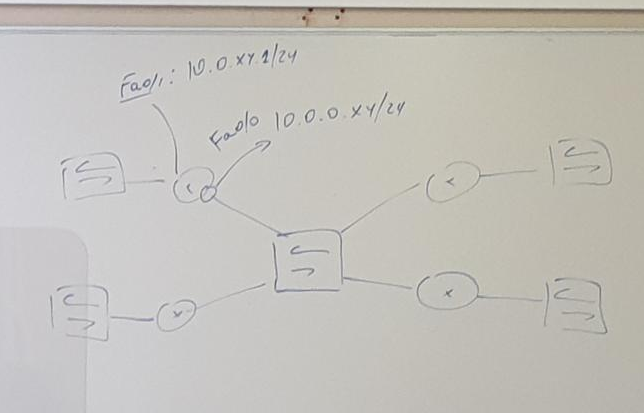
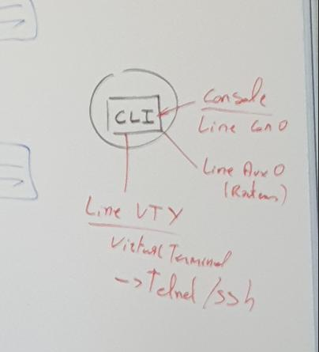

# 20210312.2 ***CONNEXION A DISTANCE SSH/TELNET***

TOPOLOGIE

--------------------------------------------------------------------------------------------------

***routeur***

***show runnning-config*** ( fin de la running-config)

      line con 0
       exec-timeout 0 0
       password 7 15130F010D24
       logging synchronous
       login
      line aux 0
      line vty 0 4                   >>>>>>>>> ligne 0/1/2/3/4 (connexion simultanée)
       login                           

ssh = obligation login mdps

##### ***configuration line vty***

P3R2(config)#line vty 0 4
P3R2(config-line)#transport input ?

  all      All protocols
  lapb-ta  LAPB Terminal Adapter
  mop      DEC MOP Remote Console Protocol
  none     No protocols
  pad      X.3 PAD
  rlogin   Unix rlogin protocol
  ssh      TCP/IP SSH protocol
  telnet   TCP/IP Telnet protocol
  udptn    UDPTN async via UDP protocol
  v120     Async over ISDN

P3R2(config-line)#transport input telnet         >>>> plus que telnet par defaut pr communiquer
P3R2(config-line)#password coucou               >>>> pas activer login car deja présent

show run :          verifier la config pour l'acceptation des parametres

          line vty 0 4
          password 7 01100911580413
          login
          transport input telnet

Control shift + 6 , ensuite  X  ======= annule la connexion telnet 

P3R2#show sessions ( montr les session telnet/ssh active)
Conn Host                Address             Byte  Idle Conn Name
*  1 10.0.0.14           10.0.0.14              0     0 10.0.0.14
   2 10.0.0.13           10.0.0.13              0     0 10.0.0.13

##### ***passer d'une session a l'autre***   
   
   FAIRE 1 + ENTER OU 2 + ENTER pour se reconnecter a la session

    P3R2#1
    [Resuming connection 1 to 10.0.0.14 ... ]

    P3R2#10.0.0.23    >>>>> PAS BESOIN DE RETAPPER TELNET 
      Trying 10.0.0.23 ... Open

##### ***terminer sessions***

      P3R2#show sessions
      Conn Host                Address             Byte  Idle Conn Name
        1 10.0.0.14           10.0.0.14              0     2 10.0.0.14
        2 10.0.0.13           10.0.0.13              0     5 10.0.0.13
      *  3 10.0.0.23           10.0.0.23             43     0 10.0.0.23

      P3R2#disconnect 3
      Closing connection to 10.0.0.23 [confirm]

##### ***COUPER LA SESSION***              >>>> clear line <vty 0>

      P3R2#show users
      Line       User       Host(s)              Idle       Location
      *  0 con 0                10.0.0.14            00:05:37
                                10.0.0.13            00:07:56
                                10.0.0.1             00:01:36
      194 vty 0                idle                 00:08:11 10.0.0.1
      195 vty 1                idle                 00:03:15 10.0.0.11

        Interface    User               Mode         Idle     Peer Address

      P3R2#clear line vty 0                        >>>>> supprimé la session distante
      [confirm]

##### ***disconnect***

    P3R2#DISCONNECT
    Closing connection to 10.0.0.1 [confirm]

##### ***login*** 

    P3R2#conf t
    Enter configuration commands, one per line.  End with CNTL/Z.
    P3R2(config)#line vty 0 4
    P3R2(config-line)#login local

***ne marche pas car pas d'user crer***

##### ***creation d'user***

    P3R2#conf t
    Enter configuration commands, one per line.  End with CNTL/Z.
    P3R2(config)#line vty 0 4
    P3R2(config-line)#login local
    P3R2(config-line)#^Z
    P3R2#conf
    *Mar 12 12:52:29.510: %SYS-5-CONFIG_I: Configured from console by console
    P3R2#conf t
    Enter configuration commands, one per line.  End with CNTL/Z.
    P3R2(config)#username PERCEVAL?
    WORD

    P3R2(config)#username PERCEVAL ?
      aaa                  AAA directive
      access-class         Restrict access by access-class
      autocommand          Automatically issue a command after the user logs in
      callback-dialstring  Callback dialstring
      callback-line        Associate a specific line with this callback
      callback-rotary      Associate a rotary group with this callback
      dnis                 Do not require password when obtained via DNIS
      nocallback-verify    Do not require authentication after callback
      noescape             Prevent the user from using an escape character
      nohangup             Do not disconnect after an automatic command
      nopassword           No password is required for the user to log in
      one-time             Specify that the username/password is valid for only one
                          time
      password             Specify the password for the user
      privilege            Set user privilege level
      secret               Specify the secret for the user
      user-maxlinks        Limit the user's number of inbound links
      view                 Set view name
      <cr>

    P3R2(config)#username PERCEVAL
    P3R2(config)#username PERCEVAL secret CESTPASFAUX

-------------------------------------------------------------------------------------------------------
##### ***SSH***

show ip ssh

    P3R2#show ip ssh
    SSH Disabled - version 1.99
    %Please create RSA keys (of atleast 768 bits size) to enable SSH v2.
    Authentication timeout: 120 secs; Authentication retries: 3
    Minimum expected Diffie Hellman key size : 1024 bits

##### ***creation clé cryptage***

    P3R2#conf t
    Enter configuration commands, one per line.  End with CNTL/Z.
    P3R2(config)#crypto key generate rsa
    % Please define a domain-name first.

ne marche pas car pas de domaine

##### ***creation de domaine***

    P3R2(config)#ip domain name cisco.lab    >>>>> change le nom pour cdp : show cdp neig

##### *** creation clé cryptage apres changement domaine***

    P3R2(config)#crypto key generate rsa
    The name for the keys will be: P3R2.cisco.lab
    Choose the size of the key modulus in the range of 360 to 2048 for your
      General Purpose Keys. Choosing a key modulus greater than 512 may take
      a few minutes.

    How many bits in the modulus [512]:768
    % Generating 768 bit RSA keys, keys will be non-exportable...[OK]

    P3R2(config)#
    *Mar 12 13:07:02.782: %SSH-5-ENABLED: SSH 1.99 has been enabled          >>>>> ssh v1 ou 2 v1.99= v1 et v2

##### ***activer le mode ssh***

    P3R2(config)#line vty 0 4
    P3R2(config-line)#transport input ssh

##### ***connection a distance SSH***

    P3R2(config-line)#transport input ssh
    P3R2(config-line)#ssh -l PERCEVAL 10.0.0.1     >>>>>> PERCEVAL = user creer avant

-------------------------------------------------------------------------------------
##### ***Connection ssh avec interface VLAN***    
      
      2960-7#conf t
      Enter configuration commands, one per line.  End with CNTL/Z.
      2960-7(config)#vlan 22
      2960-7(config-vlan)#exit
      
      2960-7#conf t
      Enter configuration commands, one per line.  End with CNTL/Z.
      2960-7(config)#int g0/1
      2960-7(config-if)#sw mode acc
      2960-7(config-if)#sw acc vlan 22
      2960-7(config-if)#

##### ***SVI*** switch virtual interface (interface vlan)

      2960-7(config)#int vlan 22
      2960-7(config-if)#
      *Mar  1 01:53:44.828: %LINEPROTO-5-UPDOWN: Line protocol on Interface Vlan22, changed state to up
      2960-7(config-if)#ip address 10.0.32.100 255.255.255.0   (.100 convention steve)
      2960-7(config-if)#

                                                                >>>>>>>>>>>verification du status up up
      2960-7#sh ip int brief
      Interface              IP-Address      OK? Method Status                Protocol
      Vlan1                  unassigned      YES NVRAM  up                    down
      Vlan22                 10.0.32.100     YES manual up                    up

      2960-7#conf t
      Enter configuration commands, one per line.  End with CNTL/Z.
      2960-7(config)#ip domain name cisco.lab

      2960-7(config)#crypto key generate rsa
      The name for the keys will be: 2960-7.cisco.lab
      Choose the size of the key modulus in the range of 360 to 4096 for your
        General Purpose Keys. Choosing a key modulus greater than 512 may take
        a few minutes.

      How many bits in the modulus [512]: 768
      % Generating 768 bit RSA keys, keys will be non-exportable...
      [OK] (elapsed time was 4 seconds)

      2960-7#show run | begin line    ( afficher la config avec begin line)
      line con 0
      exec-timeout 0 0
      password 7 0005170B0D55
      logging synchronous
      login
      line vty 0 4
      login
      line vty 5 15
      login
      !
      end

      2960-7#conf t
      Enter configuration commands, one per line.  End with CNTL/Z.
      2960-7(config)#line vty 0 15
      2960-7(config-line)#transport input ssh
      2960-7(config-line)#login local

      creation user et mots de passe
      2960-7#conf t
      Enter configuration commands, one per line.  End with CNTL/Z.
      2960-7(config)#username KARADOC secret LEGRASCESTLAVIE

##### ***verification depuis le routeur connexion ssh***

    P3R2#ssh
    *Mar 12 14:12:21.022: %SYS-5-CONFIG_I: Configured from console by console
    P3R2#ssh -l KARADOC 10.0.32.100

    Password:

##### ***ajouter route dans le routeur*** ROUTEUR !!

      P3R2(config)#ip route 10.0.11.0 255.255.255.0 10.0.0.11
      P3R2(config)#ip route 10.0.34.0 255.255.255.0 10.0.0.34
      P3R2(config)#ip route 10.0.13.0 255.255.255.0 10.0.0.13
      P3R2(config)#ip route 10.0.14.0 255.255.255.0 10.0.0.14
      P3R2(config)#ip route 10.0.21.0 255.255.255.0 10.0.0.21
      P3R2(config)#ip route 10.0.22.0 255.255.255.0 10.0.0.22
      P3R2(config)#ip route 10.0.23.0 255.255.255.0 10.0.0.23
      P3R2(config)#ip route 10.0.24.0 255.255.255.0 10.0.0.24
      P3R2(config)#ip route 10.0.31.0 255.255.255.0 10.0.0.31
      P3R2(config)#ip route 10.0.1.0 255.255.255.0 10.0.0.1

##### ***disable arp proxy*** 

      P3R2#conf t
      Enter configuration commands, one per line.  End with CNTL/Z.
      P3R2(config)#int fa0/1
      P3R2(config-if)#no ip proxy-arp
      P3R2(config-if)#int fa0/0
      P3R2(config-if)#no ip proxy-arp

##### ***passerelle par defaut switch***     !!!! SWITCH !!!!

      2960-7(config)#ip default-gateway 10.0.32.1           ( configure passerelle par defaut)

