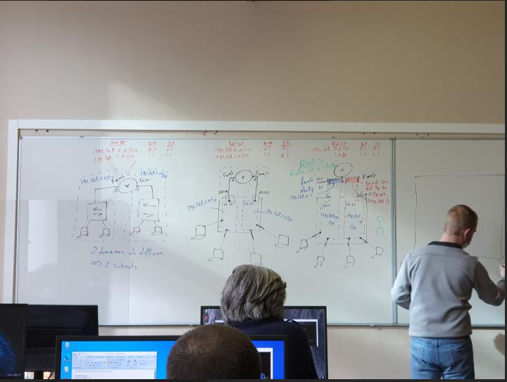
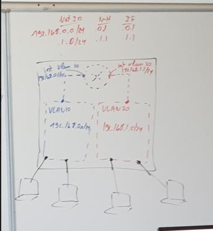

# 20210315 MULTY LAYER SWITCH

MLS = ( multy layer switch )
!!!!! une interface par domaine de diffusion !!!!

mettre le routage plus proche du domaine de diffusion 

-------------------------------------------------------------------------------

# Routeur on a stick (roas)

### ***creation vlan***

      2960-7#conf t
      Enter configuration commands, one per line.  End with CNTL/Z.
      2960-7(config)#vlan 10,20,30,40                
      2960-7(config-vlan)#vlan 666
      2960-7(config-vlan)#name DEVIL-INSIDE
      2960-7(config-vlan)#shut

      2960-7(config)#sh vlan brief
      
      VLAN Name                             Status    Ports
      ---- -------------------------------- --------- -------------------------------
      1    default                          active    Fa0/1, Fa0/2, Fa0/3, Fa0/4
                                                      Fa0/5, Fa0/6, Fa0/7, Fa0/8
                                                      Fa0/9, Fa0/10, Fa0/11, Fa0/12
                                                      Fa0/13, Fa0/14, Fa0/15, Fa0/16
                                                      Fa0/17, Fa0/18, Fa0/19, Fa0/20
                                                      Fa0/21, Fa0/22, Fa0/23, Fa0/24
                                                      Gi0/1, Gi0/2
      10   VLAN0010                         active
      20   VLAN0020                         active
      22   VLAN0022                         active
      30   VLAN0030                         active
      40   VLAN0040                         active
      666  DEVIL-INSIDE                     act/lshut
      1002 fddi-default                     act/unsup
      1003 token-ring-default               act/unsup
      1004 fddinet-default                  act/unsup
      1005 trnet-default                    act/unsup

      2960-7#conf t
      Enter configuration commands, one per line.  End with CNTL/Z.
      2960-7(config)#interface range fa0/1 - 4
      2960-7(config-if-range)#sw mode access
      2960-7(config-if-range)#sw access vlan 10
      2960-7(config-if-range)#spanning-tree portfast          >>>>> PAS DE LED ORANGE DIRECTE VERTE

      2960-7(config-if-range)#spAnning-tree portfast
      %Warning: portfast should only be enabled on ports connected to a single
      host. Connecting hubs, concentrators, switches, bridges, etc... to this
      interface  when portfast is enabled, can cause temporary bridging loops.
      Use with CAUTION

      %Portfast will be configured in 5 interfaces due to the range command
      but will only have effect when the interfaces are in a non-trunking mode.

      2960-7(config-if-range)#interface range fa0/5 - 8
      2960-7(config-if-range)#sw mode access
      2960-7(config-if-range)#sw access vlan 20
      2960-7(config-if-range)#span portf
      

      2960-7(config)#int range fa0/9 - 12
      2960-7(config-if-range)#sw mode acc
      2960-7(config-if-range)#sw acc vlan 30
      2960-7(config-if-range)#span portf

      2960-7(config)#int ran fa0/13 - 16
      2960-7(config-if-range)#sw mode acc
      2960-7(config-if-range)#sw acc vlan 40
      2960-7(config-if-range)#spawn portf

### ***creation du trunk***
      
      2960-7#conf t
      Enter configuration commands, one per line.  End with CNTL/Z.
      2960-7(config)#int g0/1
      2960-7(config-if)#switchport trunk encapsulation dot1q             >>> seuelement sur multilayer
      2960-7(config-if)#switchport mode trunk
      2960-7#sh int g0/1 switchport

      Name: Gi0/1
      Switchport: Enabled
      Administrative Mode: trunk
      Operational Mode: down                          >>>>>>> parceque port routeur shutdown
      Administrative Trunking Encapsulation: dot1q
      Negotiation of Trunking: On
      Access Mode VLAN: 1 (default)
      Trunking Native Mode VLAN: 1 (default)

### ***deplacer les autre interface dans le vlan 666***

      2960-7#conf t
      Enter configuration commands, one per line.  End with CNTL/Z.
      2960-7(config)#int range fa0/17 - 24 , g0/2
      2960-7(config-if-range)#sw mode acc
      2960-7(config-if-range)#sw acc vlan 666
      2960-7(config-if-range)#shut
      2960-7(config-if-range)#description --UNUSED--                      ( tres utiles )

      2960-7#sh int status
        Port      Name               Status       Vlan       Duplex  Speed Type
        Fa0/1                        notconnect   10           auto   auto 10/100BaseTX
        Fa0/2                        notconnect   10           auto   auto 10/100BaseTX
        Fa0/3                        notconnect   10           auto   auto 10/100BaseTX
        Fa0/4                        notconnect   10           auto   auto 10/100BaseTX
        Fa0/5                        notconnect   20           auto   auto 10/100BaseTX
        Fa0/6                        notconnect   20           auto   auto 10/100BaseTX
        Fa0/7                        notconnect   20           auto   auto 10/100BaseTX
        Fa0/8                        notconnect   20           auto   auto 10/100BaseTX
        Fa0/9                        notconnect   30           auto   auto 10/100BaseTX
        Fa0/10                       notconnect   30           auto   auto 10/100BaseTX
        Fa0/11                       notconnect   30           auto   auto 10/100BaseTX
        Fa0/12                       notconnect   30           auto   auto 10/100BaseTX
        Fa0/13                       notconnect   40           auto   auto 10/100BaseTX
        Fa0/14                       notconnect   40           auto   auto 10/100BaseTX
        Fa0/15                       notconnect   40           auto   auto 10/100BaseTX
        Fa0/16                       notconnect   40           auto   auto 10/100BaseTX
        Fa0/17    --UNUSED--         disabled     666          auto   auto 10/100BaseTX
        Fa0/18    --UNUSED--         disabled     666          auto   auto 10/100BaseTX
        Fa0/19    --UNUSED--         disabled     666          auto   auto 10/100BaseTX
        Fa0/20    --UNUSED--         disabled     666          auto   auto 10/100BaseTX
        Fa0/21    --UNUSED--         disabled     666          auto   auto 10/100BaseTX
        Fa0/22    --UNUSED--         disabled     666          auto   auto 10/100BaseTX

        Port      Name               Status       Vlan       Duplex  Speed Type
        Fa0/23    --UNUSED--         disabled     666          auto   auto 10/100BaseTX
        Fa0/24    --UNUSED--         disabled     666          auto   auto 10/100BaseTX
        Gi0/1                        notconnect   1            auto   auto 10/100/1000BaseTX
        Gi0/2     --UNUSED--         disabled     666          auto   auto 10/100/1000BaseTX

      2960-7#copy r s
        Destination filename [startup-config]?

## ***ROUTEUR***

### *** CREATION SUB INTERFACE***      ( pas besoin de les no-shut, car crée et active directement )

      P3R2#conf t
        Enter configuration commands, one per line.  End with CNTL/Z.
        P3R2(config)#int f0/0
        P3R2(config-if)#no sh
        P3R2(config-if)#int fa0/0.110                                     >>> SUB INTERFACE

        P3R2(config-subif)#
        P3R2(config-subif)#encapsulation dot1q 10                  >>> lien avec vlan 10 

        P3R2(config)#int fa0/0.120
        P3R2(config-subif)#encapsulation dot1q 20
        P3R2(config-subif)#ip address 10.0.20.1 255.255.255.0
        P3R2(config-subif)#int fa0/0.130
        P3R2(config-subif)#encapsulation dot1q 30
        P3R2(config-subif)#ip address 10.0.30.1 255.255.255.0
        P3R2(config-subif)#int fa0/0.140
        P3R2(config-subif)#encapsulation dot1q 40
        P3R2(config-subif)#ip address 10.0.40.1 255.255.255.0
        P3R2(config-subif)#exit

### ***verification rapide des subinterface***

        P3R2#sh ip int brief
          Interface                  IP-Address      OK? Method Status                Protocol
          FastEthernet0/0            unassigned      YES NVRAM  up                    up
          FastEthernet0/0.110        10.0.10.1       YES manual up                    up
          FastEthernet0/0.120        10.0.20.1       YES manual up                    up
          FastEthernet0/0.130        10.0.30.1       YES manual up                    up
          FastEthernet0/0.140        10.0.40.1       YES manual up                    up
          FastEthernet0/1            unassigned      YES NVRAM  administratively down down
          Serial0/1/0                unassigned      YES NVRAM  administratively down down
          Serial0/1/1                unassigned      YES NVRAM  administratively down down
          SSLVPN-VIF0                unassigned      NO  unset  up                    up

        P3R2#sh int fa0/0.110
          FastEthernet0/0.110 is up, line protocol is up
            Hardware is Gt96k FE, address is 001e.7a4c.a88e (bia 001e.7a4c.a88e)
            Internet address is 10.0.10.1/24
            MTU 1500 bytes, BW 100000 Kbit/sec, DLY 100 usec,
              reliability 255/255, txload 1/255, rxload 1/255
            Encapsulation 802.1Q Virtual LAN, Vlan ID  10.
            ARP type: ARPA, ARP Timeout 04:00:00
            Last clearing of "show interface" counters never

        P3R2#sh ip route

                Gateway of last resort is not set

                10.0.0.0/24 is subnetted, 4 subnets
            C       10.0.10.0 is directly connected, FastEthernet0/0.110
            C       10.0.30.0 is directly connected, FastEthernet0/0.130
            C       10.0.20.0 is directly connected, FastEthernet0/0.120
            C       10.0.40.0 is directly connected, FastEthernet0/0.140

      

