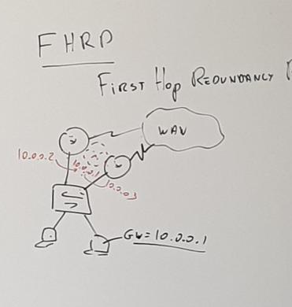
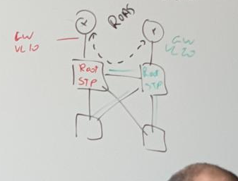

# 20210330.3 FHRP                   first hop redundancy protocols

redondance de passerelle par default

3 protocols pour  ca

- HSRP (cisco)
- VRRP (standar)
- GLBP (cisco)

HSRP ]  1 Actif et X standby
VRRP ]  1 Actif et X standby
GLBP ]  1 boss et X nombre de travailleurs

HSRP VRRP l'actif bosse tout seul
Glbp peut utiliser les ressources de tout les autres

attention pas sur glbp cette annotation

