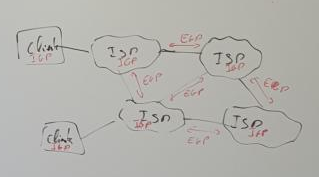
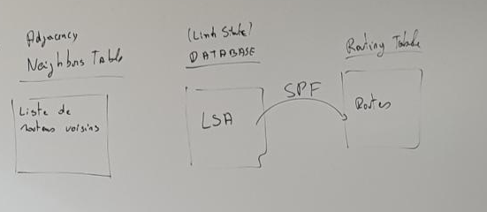
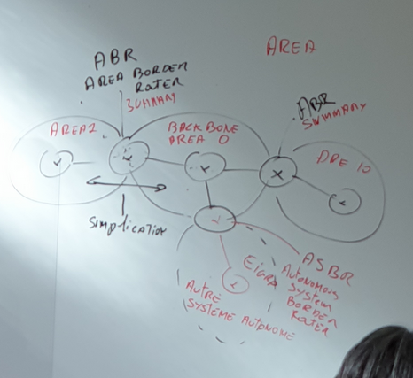
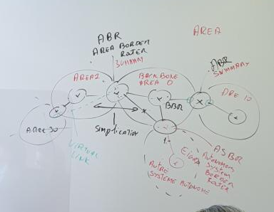
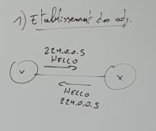
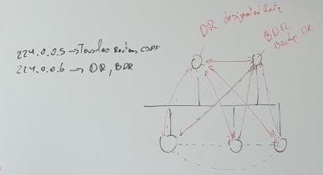
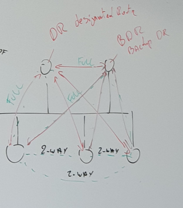

# 20210402  OSPF // generalité protocol de routage  [ v2 = ipv4 , v3 = ipv6]

##### ***protocol de routage statique*** :

    Probleme de réactivité 

##### ***Protocol de routage dynamique*** :

    2 interets majeur 
        - redondance 
        - reagit au changement de topologie

##### ***Categorie de protocol de routage*** :

    - Déterminer les meilleurs routes
    - Assurer un chemin sans boucle
    
##### ***Catégorie*** :

    EGP : exterior gateway protocol
    IGP : inferior gateway protocol 

egp = stabilité, prends quelque secondes pour appliqué les modifications, au niveau d'internet et des interconnections on prefere le choix des routes par l'humain

##### ***EGP*** = Protocol : 
      
                 - BGP (border gateway protocol) [ Protocol a vecteur de chemin ]

##### ***IGP***= Protocol : 

                 - Protocol à vecteur de distance  : rip(standard), igrp(cisco), EIGRP (cisco) (extended inhanced gateway routing protocol) [protocol de vecteur de distance "avancé" ou dit "hybrid"]
                 [ Metric Maximum (distance administrative)]

                 - Protocol à état de lien : Ospf (standard), IS-IS(standard)
                 [ point faible : instabilité du reseau ]

les protocols de routages quand ils ont recoltés leur informations ont un ***algorythme*** ( pathfinding ) qui permets de selectionné la meilleur route 

RIP                       : utilise l'algo de bellman-ford ( 2 mec )
IGRP ET EIGRP             : utilise l'algo DUAL
OSPF ET IS-IS             : utilise l'algo shortest path first ( aussi apeller algorythm de dijkstra ) 

## ***OSPF***          [ Open short path first ]

Protocol a état de lien ( Link-State protocol ) 
Algorythme > Dijkstra/SPF

                      exemple : 10.0.0.0/24 [ X/Y ] via ....        

                      X = distance administrative [ Connecté = 0, Statique = 1, BGP = 20/200, EIGRP = 90/170, OSPF = 110, IS-IS = 115, RIP =120 ]    
                      Y = Metrics par defaut      []

- Le protocol est classless 
- Capable de gerer VLSM
- Summarization Manuelle **  (pas n'importe ou)
- Updates dynamiques
- Ospf communique en multicast

------------------------------------------------------------------------------------------------------------------------------------------------------

#### ***fonctionnement d'ospf***

Adjencency / neighbords table :

                                Liste de routeurs voisins
                                -- Etablissement d'adjacence --
                                -- type de packet OSPF --   ( utilise la couche 4 , couche transport qu'il fait lui meme)

(Link State) Database : 

                                LSA    ( Lsa = link state advertisement )
                                -- type de lsa -- [ DR , BDR ]

routing table :                 
                                
                                Routes

ABR = AREA BORDER ROUTER  ( la ou on summarise)
ASBR = Autonomous system border Routeur ( different protocol entre eux) on peut aussi summariser a cet endroit
BBR = Back bone routeur  ( ici dans le schema routeur principal de la zone 0 )
** au sein d'une zone impossible de summarisé

## Configuration ospf

#### 1) ***Etablissement des adjacents*** ( echange de packet hello entre deux routeurs connecté )

que contient le message Hello :

- routeur id  = 32 bits ressemble a une adresse ipv4 mais n'en est pas une [* unique]
- Hello-timer = intervalle entre deux hello [*]
- Dead-timer  = durée de vie du hello [*]
- Network / Masque intf [*]
- Priorité
- Area Id   [*]
- Addresse du DR  : Designated Routeur
              BDR : Backup Designated routeur
              routeur adjacent : ( relation avec lequel j'echange des donnés ospf [en gros permet de savoir si c est un nouveau copain] )

##### ***criteres d'adjacence***

        point a point : les deux communiques en 224.0.0.5
        Reseau Ethernet :
        
        Trait vert = adjacence mais pas dechange d 'informations

        Plus grand routeur id = BR et deuxieme BDR  ( propre au reseau partager )

        si on veux influencer qui est br ou bdr , on peut jouer sur la priorité 
        on peut aussi dire qu'un routeur ne veux pas participer a l'election du DR/BDR

        ospf orienté stabilité , donc meme si un routeur avec une priorité est ajouté au reseau partager , celui ci devras attendre que le BR et le BDR tombe en panne     pour prendre leur place

##### ***Routeur-ID***

        32 bits
        xxx.xxx.xxx.xxx

        1) routeur id configuré
        2) plus grande addresse sur une interface loopback
        3) plus grande addresse sur une autre interface

tout ce qui peut etre fait pour stabilisé la topologie doit etre fait !!!!!!

#### 2) Etat des adjacence 

        etat initial = Down State     ( etat qui ne dure qu'une fraction de seconde mais c'est l'etat initial )                       >>>> HELLO
                      Init state     ( un HELLO a été recu )                                                                          >>>> HELLO
                      2 way state    ( Hello ok )     [ Stable si ...]                                                                >>>> HELLO
                      Exstart State  ( échange de resumé de base de données LSDBD [link state database editor])                       >>>> LSDBD    
                      Loading State  ( LSR : LINK STATE REQUEST / LSU : LINK STATE UPDATE )                                           >>>> LSR / LSU
                      Full-state     ( synchronisation terminée )  [ STABLE ]

LSACK : accusé de reception ( tout message ospf est acquité a l exception des ack et des hellos )

##### ***LSA***

          LSA 1 : Routeur LSA   Origine : Routeur         ( carte d'identité du routeur dans la topologie ) 
          LSA 2 : Network LSA   Origine : DR              ( identifie un reseau partager ( exemple reseau ethernet ) )       
          
          si qu'une area que ces deux type de LSA type 1 et 2 sont contenue dans la zone [ ne sorte jamais d'une area à l'autre ]
-------------------------------------------------------
          LSA 3 : Summary       Origine : ABR                          ( permet de lister les reseau dans une area distante ) (adresse reseau et masque)      
          LSA 4 : ASBR          Origine : ASBR                         ( Carte identité de l'asbr )
          LSA 5 : External      Origine : ASBR                         ( represente un reseau qui a été redistribuer dans OSPF  )
-------------------------------------------------------------------------------------------------------  
          LSA 7 : NSSA                                                 ( Externe mais qui n'en a pas l'air ) ( NOT SO STUBBY AREA )
                                                                       ( not so stubby / totaly stuby / totaly not so stubby ) 

##### ***Metrique OSPF***  ( COST )

la metrique se calcule = une fraction 100 (MBPS) / BW ( exprimé en  mbps) 

Serials 1.544 >>>>>>>>> Cost = 64
Eth 10bmsp    >>>>>>>>> Cost = 100/10 = 10
Fast Eth      >>>>>>>>> Cost = 100/100 = 1
Giga          >>>>>>>>> Cost = 100/1000 = 1
TE            >>>>>>>>> Cost = 100/10000 = 1

calcul chemin = cost additionné les un derriere les autres 

##### Network Type                  
                                   Hello time                 Dead time                   DR/BDR                      Adj-dynamique
                                   ----------                 ---------                   ------                      -------------   

      Point to point      :        10 secondes                40  Secondes                  Non                            Oui     
      Broadcast           :        10 secondes                40  Secondes                  Oui                            Oui
      non-broadcast       :        30 secondes                120 Secondes                  Oui                            Non 
      Point to multipoint :        30 secondes                120 Secondes                  Non                            Oui  
      Point to Multipoint :        30 secondes                120 secondes                  Non                            Non  
      non broadcast 
      Loopback            :        Non                        Non                           Non                            Non 

