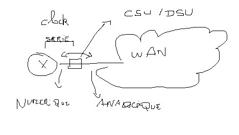
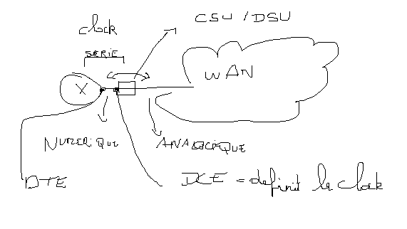
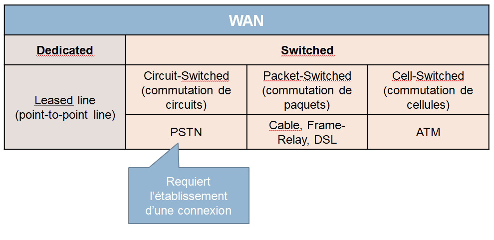
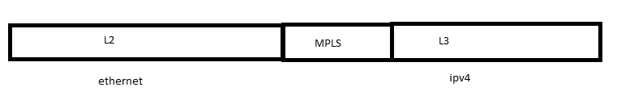

# 20210306 ISP // interface serial commandes

## **WAN introduction**

*CSU/DSU* (channel service unit/digital service unit)

*DTE* data terminal equipement 
*DCE* Data communication equipement

dte qui s'adapte a la clock dce fournis la clock
serial = dte + dce

*PCM* = Pulse code modulation
unité de basse qu'on peut avoir sur les bandes seriels !

*DS0* = canal communication de base basé sur le pcm

*T1* = 1.544 Mbits/s bande passante defaut interface serial cisco (america)
*E1* = 2.048 Mbits/s  (europe)
*J1* = 2.048 Mbits/s  (japon)

**CPE** = Customer premises Equipment
**DEMARC** = frontiere de responsabilité (ex: introduction proximus)

point a point tjrs même extremité 

point a point ligne loué                   = PPP hdlc
Circuit-switched (commutation de circuits) = pstn, possible de changé de connection , numero de telephone exemple tjrs 2 personnes
Packet-switched (commuation de paquet)     = technologie dsl + cable , (commutation de paquet)
Cell-switched (commuation de cellues)      = atm, meme que paquet mais beaucoup plus petit en quantité de bytes (permet de traité plus de chose                                                        differentes sur un meme temps de travail)

mpls-vpn remplace frame relay (protocol lv 2.5)

**PPP point to point protocol**
lcp = link control protocol 

## ***Ethernet pour le WAN***
réseau du provider fait office de switch pour le client

Ethernet over mpls EoMPLS ( fournit un service de niveau 2)

adsl // assynchrone
sdsl // syncrhone

# ***Config cli interface serial***

***P3R2#show interface serial 0/1/0***

    Serial0/1/0 is administratively down, line protocol is down
    Hardware is GT96K Serial
    MTU 1500 bytes, BW 1544 Kbit/sec, DLY 20000 usec,     >>>> Bw = T1
    reliability 255/255, txload 1/255, rxload 1/255
    Encapsulation HDLC, loopback not set >>>>>> protocol par defaut hdlc
    *****le reste n'est pas vraiment impacté en serial***** 
    Keepalive set (10 sec)
    CRC checking enabled
    Last input never, output never, output hang never
    Last clearing of "show interface" counters 00:15:34
    Input queue: 0/75/0/0 (size/max/drops/flushes); Total output drops: 0
    Queueing strategy: weighted fair
    Output queue: 0/1000/64/0 (size/max total/threshold/drops)
    Conversations  0/0/256 (active/max active/max total)
    Reserved Conversations 0/0 (allocated/max allocated)
    Available Bandwidth 1158 kilobits/sec
    5 minute input rate 0 bits/sec, 0 packets/sec
    5 minute output rate 0 bits/sec, 0 packets/sec
    0 packets input, 0 bytes, 0 no buffer
    Received 0 broadcasts, 0 runts, 0 giants, 0 throttles
    0 input errors, 0 CRC, 0 frame, 0 overrun, 0 ignored, 0 abort
    0 packets output, 0 bytes, 0 underruns
    0 output errors, 0 collisions, 1 interface resets
    0 unknown protocol drops

***P3R2#show controllers s0/1/0***

    Interface Serial0/1/0
    Hardware is GT96K
    DTE V.35 clocks stopped.       >>>>>> dce/dte + clock rate -- dte s'adapte donc pas de clock
    idb at 0x666A1DD0, driver data structure at 0x666A3304
    wic_info 0x666A3928
    Physical Port 0, SCC Num 0
    le reste des parametres ne nous concerne pas ....

    clock fournis
    P3R2#sH CONTROLLERS s0/1/0
    Interface Serial0/1/0
    Hardware is GT96K
    DTE V.35 TX and RX clocks detected. ()

***interface s0/1/0***

    P3R2#conf t
    Enter configuration commands, one per line.  End with CNTL/Z.
    P3R2(config)#int s0/1/0
    P3R2(config-if)#no shut
    P3R2(config-if)#
    *Mar  8 12:18:59.339: %LINK-3-UPDOWN: Interface Serial0/1/0, changed state to down
    P3R2(config-if)#
    P3R2#sh ip int brief
    Interface                  IP-Address      OK? Method Status                Protocol
    FastEthernet0/0            unassigned      YES unset  administratively down down
    FastEthernet0/1            unassigned      YES unset  administratively down down
    Serial0/1/0                unassigned      YES unset                   down down
    Serial0/1/1                unassigned      YES unset  administratively down down
    SSLVPN-VIF0                unassigned      NO  unset  up                    up

***configuration du serial***

    P3R2#conf t
    Enter configuration commands, one per line.  End with CNTL/Z.
    P3R2(config)#int s0/1/0
    P3R2(config-if)#desc SERIAL
    P3R2(config-if)#clock rate ?
    This command applies only to DCE interfaces
      <300-8000000>    Choose clockrate from list above

    P3R2(config-if)#clock rate 8000000 (bit par seconde -- si dte, commande inutile car dte ne configure pas la clock)

***addressage du serial***

    P3R2#conf t
    Enter configuration commands, one per line.  End with CNTL/Z.
    P3R2(config)#int s0/1/0
    P3R2(config-if)#ip address 192.168.0.2 255.255.255.0

***encapsulation ppp***

    P3R2(config)#int s0/1/0
    P3R2(config-if)#encapsulation ppp ( activation de l'encapsulation ppp)

***creation loopback***

    P3R2#conf t
    Enter configuration commands, one per line.  End with CNTL/Z.
    P3R2(config)#int l0
    P3R2(config-if)#
    *Mar  8 14:00:58.171: %LINEPROTO-5-UPDOWN: Line protocol on Interface Loopback0, changed state to up
    P3R2(config-if)#ip add 2.2.2.2 255.255.255.255 ( si 192.168.1.2 = 2.2.2.2)
    
***creation route pour sérial***

    P3R2(config-if)#ip route 1.1.1.1  255.255.255.255 serial 0/1/0 (donner son interface pas le nexthop) ( passerais en priorité par rapport a une route static normal)

***configurer bande passante*** (cir 2mbps = provider garanti 2mbps)

    P3R2(config)#int s0/1/0
    P3R2(config-if)#bandwidth ?
    <1-10000000>  Bandwidth in kilobits
    inherit       Specify that bandwidth is inherited
    receive       Specify receive-side bandwidth
    P3R2(config-if)#bandwidth 2000                                            ( 2mbps )

***verifier bandwidth***

    P3R2#show interface s0/1/0
    Serial0/1/0 is up, line protocol is up
    Hardware is GT96K Serial
    Description: SERIAL
    nternet address is 192.168.0.2/24
    MTU 1500 bytes,BW 2000 Kbit/sec, DLY 20000 usec,                    delay eigrp

***modifier delay***

    P3R2#conf t
    Enter configuration commands, one per line.  End with CNTL/Z.
    P3R2(config)#int s0/1/0
    P3R2(config-if)#delay ?
    <1-16777215>  Throughput delay (tens of microseconds)      !!!!!!!!! temps en microsecond

***changer mtu***

    P3R2#conf t
    Enter configuration commands, one per line.  End with CNTL/Z.
    P3R2(config)#int s0/1/0
    P3R2(config-if)#mtu ?
      <64-17940>  MTU size in bytes
    P3R2(config-if)#mtu

***********************************************************************************************************************************
NOTE complé steve sur [1/0] dans ip route 
***note de distance administrative et métrique***

    S 2.2.2.2 [1/0] via 192.168.0.2  1 = distance administrative 0 = metrique(calculer par le protocl de routage)
                      route connecte = 0 
                      route static   = 1
                      ospf           = 110
                      n'a de sens que localement , permet au routeur de faire ses choix
                      excepetion protocl qui n'utilise pas ca = BGP (protocol de provider)
                                          
***********************************************************************************************************************************

